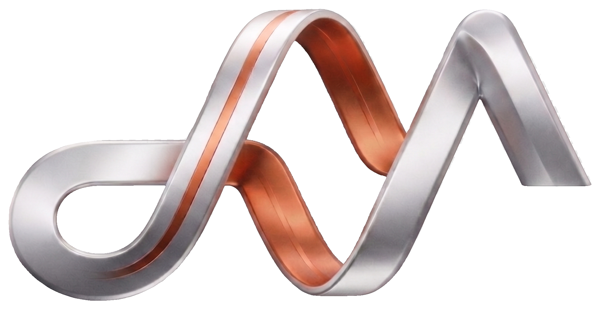
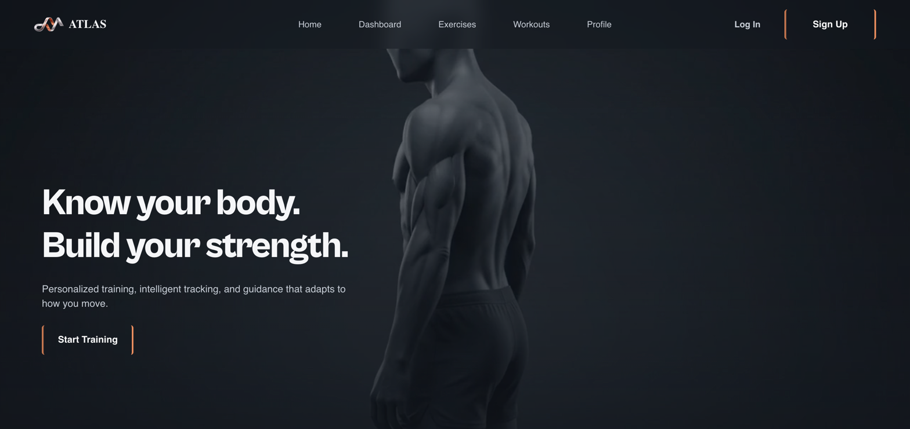
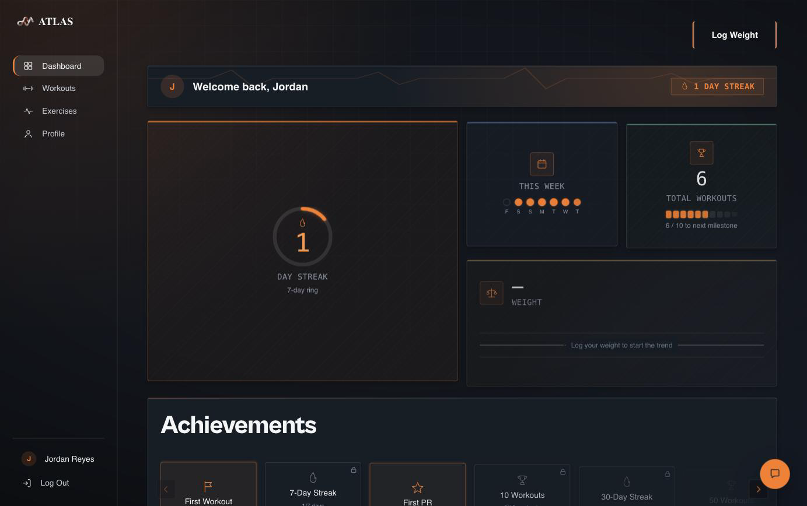
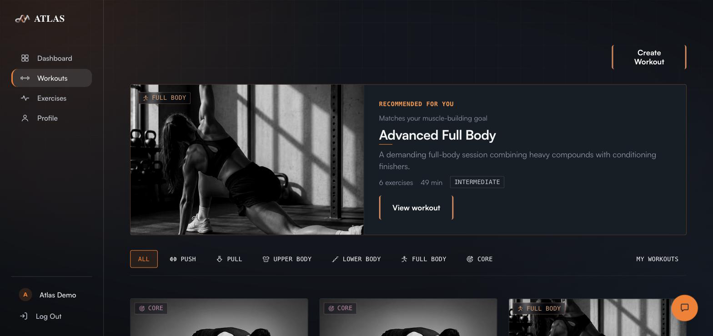
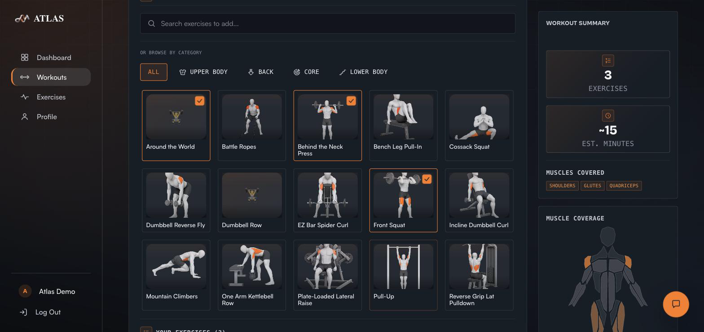
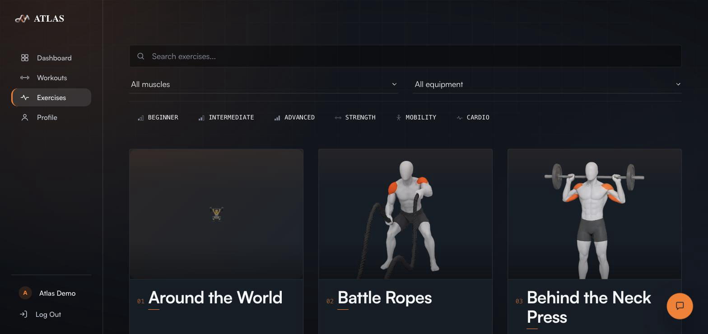
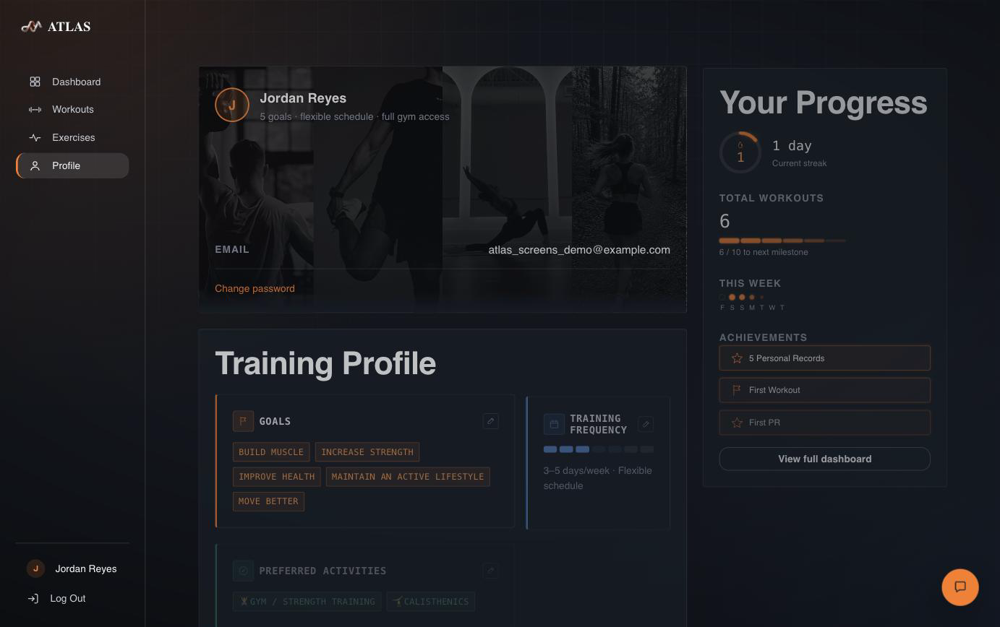
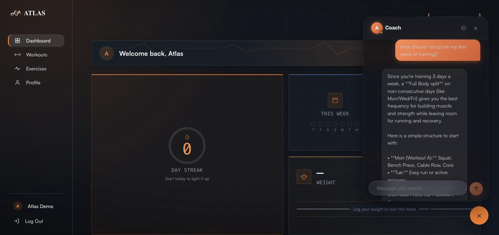

<p align="center">
  
</p>

<h1 align="center">ATLAS</h1>
<p align="center"><i>A fitness platform to plan your training, track your progress, and learn proper technique — with an AI coach that adapts your workouts to your preferences, injuries, lifestyle, and equipment.</i></p>

<p align="center">
  
  
  
  
  
  
  
</p>

---

## Overview

A fitness platform to plan your training, track your progress, and learn proper technique — with an AI coach that adapts your workouts to your preferences, injuries, lifestyle, and equipment.

It combines a scroll-driven anatomical hero experience on landing, an AI training coach with real conversational memory, a full exercise library sourced from real datasets, a custom workout builder with live muscle-coverage feedback, and a gamified dashboard that tracks streaks, milestones, and personal records. The result is a single cohesive product spanning onboarding, planning, execution, and progress tracking — not a collection of disconnected screens.

## Screenshots

| Landing Page | Dashboard |
|---|---|
|  |  |

| Workouts | Create Workout |
|---|---|
|  |  |

| Exercise Library | Profile |
|---|---|
|  |  |

| AI Coach |
|---|
|  |

*All screenshots above are captured from a live local run of the app.*

## Features

- **Scroll-scrubbed anatomical hero** — the landing page's hero video is driven by scroll position (GSAP `ScrollTrigger`) rather than autoplay, turning the page itself into a scrubber.
- **AI training coach** — a Gemini-backed conversational agent with persistent chat sessions/history and long-term memory of the user's training context, not a stateless Q&A widget.
- **Personalized onboarding** — a 9-step guided flow (basics → goals → training frequency → activities → exercise preferences → recovery → equipment → review) that builds a real training profile; any single step can later be reopened and edited directly from the Profile page without repeating the whole flow.
- **Gamified dashboard** — a streak ring, a rolling 7-day activity strip, workout-count milestones, and unlockable achievement badges (first workout, first PR, workout-count and streak tiers).
- **Full exercise library** — ~2,900 exercises combining the Kaggle *Gym Exercise Data* dataset with a curated RepDB "enhanced" tier (real photos/animations, properly attributed), filterable by muscle, equipment, and difficulty, with typo-tolerant fuzzy search and per-exercise name aliases.
- **Custom workout builder** — a multi-step builder with a live SVG muscle-coverage map that brightens per region as exercises are added, category/goal badges, and exercise-history autofill that pre-fills sets/reps/weight from the last time you logged that exact exercise.
- **Workout execution & calendar tracking** — a guided session mode with per-set logging, automatic personal-record detection, and workout history for progress review over time.

## Tech Stack

**Client** (`client/`)
- React 19 + TypeScript, built with Vite
- React Router for routing
- GSAP (`ScrollTrigger`) for scroll-driven animation
- `@react-three/fiber` + `@react-three/drei` + `three` for 3D
- `@tabler/icons-react` for iconography
- Axios for API calls
- Plain CSS (component-scoped, CSS custom properties) — no CSS-in-JS or utility framework
- `oxlint` for linting

**Server** (`server/`)
- Node.js + Express 5, TypeScript
- MongoDB via Mongoose
- JWT auth (`jsonwebtoken`) + `bcrypt` for password hashing
- `@google/genai` (Gemini) for the AI Coach
- Voyage AI embeddings for the RAG knowledge base
- `resend` for transactional email (password reset)
- `csv-parse` for dataset import tooling
- `vitest` for testing, `tsx` + `nodemon` for the dev loop

## Project Structure

```
ATLAS/
├── client/                  # React + Vite + TypeScript SPA
│   └── src/
│       ├── app/              # routes, router, top-level providers
│       ├── components/       # shared UI primitives (Button, Modal, GlassCard, Input, ...)
│       ├── features/         # feature modules: auth, onboarding, workouts, exercises,
│       │                     #   dashboard, profile, coach, activities, progress
│       ├── pages/             # top-level routed pages (Landing, Showcase)
│       ├── services/          # per-domain API clients
│       ├── hooks/, styles/, assets/
│
├── server/                  # Node + Express + TypeScript API
│   └── src/
│       ├── app.ts, server.ts
│       ├── config/            # env config, database connection
│       ├── middleware/        # auth middleware, etc.
│       └── features/          # auth, users, exercises, workouts, workoutTemplates,
│                              #   dashboard, personalRecords, progress, activities,
│                              #   aiCoach, knowledge (RAG), health
│
└── docs/                    # product/technical documentation + screenshots
```

## Getting Started

**Prerequisites:** Node.js ≥ 20, a MongoDB connection string (local or [Atlas](https://www.mongodb.com/atlas)), and a [Gemini API key](https://ai.google.dev/) if you want the AI Coach to work.

### 1. Server

```bash
cd server
npm install
```

Create `server/.env`:

```env
NODE_ENV=development
PORT=5002
DATABASE_URL=<your MongoDB connection string>
JWT_SECRET=<a long, random string>
GEMINI_API_KEY=<optional — required for the AI Coach>
VOYAGE_API_KEY=<optional — required for RAG knowledge embeddings>
CLIENT_ORIGIN=http://localhost:5173
CLIENT_URL=http://localhost:5173
RESEND_API_KEY=<optional — required for password-reset emails>
EMAIL_FROM=ATLAS <onboarding@resend.dev>
```

```bash
npm run dev
```

The API runs at `http://localhost:5002` (health check: `GET /api/health`).

### 2. Client

```bash
cd client
npm install
```

Create `client/.env`:

```env
VITE_API_URL=http://localhost:5002/api
```

```bash
npm run dev
```

The app runs at `http://localhost:5173`.

### 3. (Optional) Seed data

Run from `server/`, after the database is connected:

```bash
npm run import:exercises          # bulk exercise catalog (Kaggle dataset)
npm run import:repdb               # RepDB "enhanced" exercise tier
npm run seed:workout-templates     # system workout templates
npm run seed:knowledge             # RAG knowledge base for the AI Coach
```

### Other useful commands

| Command | Where | What it does |
|---|---|---|
| `npm run build` | `client/`, `server/` | Production build |
| `npm start` | `server/` | Run the compiled production build |
| `npm test` | `server/` | Run the test suite (vitest) |
| `npm run lint` | `client/` | Lint the client (oxlint) |

## Third-Party Content & Attribution

ATLAS's exercise library combines two external sources, plus one piece of reused open-source SVG shape data:

- **RepDB** (CC BY-NC 4.0) — real photos/animations and structured data for a 16-exercise "enhanced" tier, attributed in-app on every exercise page it appears on.
- **Kaggle "Gym Exercise Data"** (`niharika41298/gym-exercise-data`) — the bulk ~2,889-exercise catalog.
- **`react-body-highlighter`** (MIT) — the underlying muscle-region SVG coordinate data behind the Create Workout page's live muscle-coverage map, redrawn with ATLAS's own colors, glow, and intensity animation.

Full attribution text, license details, and non-commercial-use terms are documented in [`docs/THIRD_PARTY_CONTENT.md`](./docs/THIRD_PARTY_CONTENT.md) — read that before adapting this project for commercial use.

## Author & Academic Context

This project was built as a final-year capstone project by **[Your Name]**, [Program / University Name], [Year].
